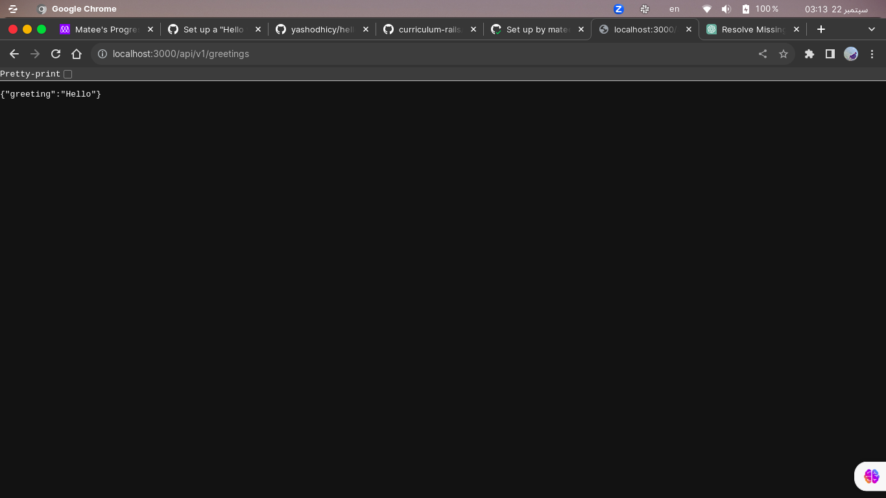

<a name="readme-top"></a>

<div align="center">
  <h1>Hello world backend</h>
</div>

<!-- TABLE OF CONTENTS -->

# 📗 Table of Contents

- [📖 About the Project](#about-project)

  - [🛠 Built With](#built-with)
    - [Key Features](#key-features)
- [💻 Getting Started](#getting-started)
  - [Prerequisites](#prerequisites)
  - [Setup](#setup)
- [👥 Authors](#authors)
- [🔭 Future Features](#future-features)
- [🤝 Contributing](#contributing)
- [⭐️ Show your support](#support)
- [🙏 Acknowledgements](#acknowledgements)
- [:question: FAQ](#faq)
- [📝 License](#license)

<!-- PROJECT DESCRIPTION -->

# 📖 Hello world backend<a name="about-project"></a>

**Hello world backend:** is the back is a hello world app using rails api.

- Frontend link: <a href="https://github.com/matee-safi/hello-world-frontend.git" target="_blank">https://github.com/matee-safi/hello-world-frontend.git</a>

# Screenshots
end-point

## 🛠 Built With <a name="built-with"></a>

  <ul>
    <li>Ruby</li>
    <li>Ruby On Rails</li>
    <li>PostgreSQL</li>
  </ul>

<!-- Features -->

### Key Features <a name="key-features"></a>

- [x] **Display Random greeting**


<p align="right">(<a href="#readme-top">back to top</a>)</p>

## Getting Started

To get a local copy up and running, follow these steps.

### Prerequisites
In order to run this project you need:
  * A basic understanding of Ruby, Rails and Git
  * A postgresql connection
  * Create some data before running to see Greatings
### Usage
1. Install Ruby
1. Install Rails
2. Clone this repo 
```
git clone https://github.com/matee-safi/hello-world-backend.git
```

To run the project, execute the following command:

```
  rails s
```

To add some greetings to your application add 
these to greeting table using 
```
rails console
```

```
# Create the first greeting
Greeting.create(content: "Hello")
# Create the second greeting
Greeting.create(content: "Hola")
# Create the third greeting
Greeting.create(content: "Ola")
# Create the fourth greeting
Greeting.create(content: "Salaam")
# Create the fifth greeting
Greeting.create(content: "Salut")
```

<p align="right">(<a href="#readme-top">back to top</a>)</p>

<!-- AUTHORS -->

## 👥 Authors <a name="authors"></a>

👤 : **Matee Safi**

- GitHub: [@matee-safi](https://github.com/matee-safi)


<p align="right">(<a href="#readme-top">back to top</a>)</p>


<!-- FUTURE FEATURES -->

## 🔭 Future Features <a name="future-features"></a>

- [ ] **Modern UI**

<p align="right">(<a href="#readme-top">back to top</a>)</p>

<!-- CONTRIBUTING -->

## 🤝 Contributing <a name="contributing"></a>

Contributions, issues, and feature requests are welcome!

Feel free to check the [issues page](../../issues/).

<p align="right">(<a href="#readme-top">back to top</a>)</p>

<!-- SUPPORT -->

## ⭐️ Show your support <a name="support"></a>

If you like this project please give us a star

<p align="right">(<a href="#readme-top">back to top</a>)</p>

<!-- ACKNOWLEDGEMENTS -->

## 🙏 Acknowledgments <a name="acknowledgements"></a>

I would like to thank microverse for making this possible

<p align="right">(<a href="#readme-top">back to top</a>)</p>

<!-- LICENSE -->

## 📝 License <a name="license"></a>

This project is [MIT](./LICENSE) licensed.

<p align="right">(<a href="#readme-top">back to top</a>)</p>